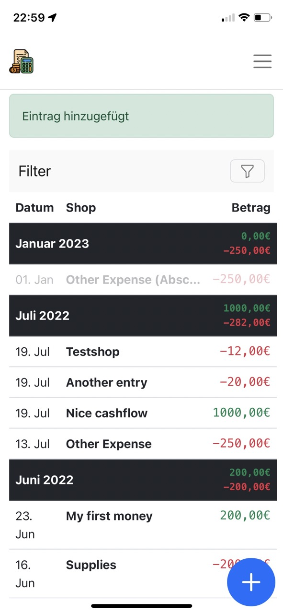
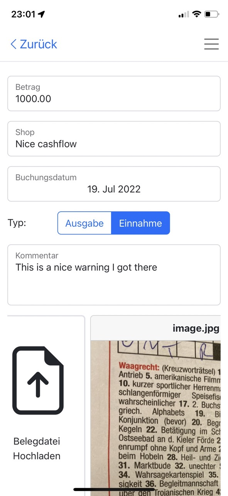
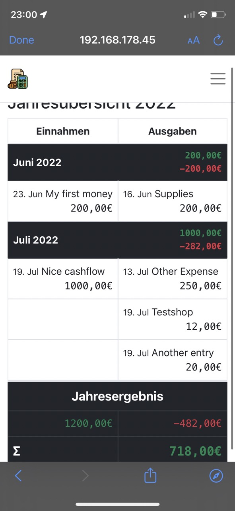

# BookKeeper

A simple Django App to keep a ledger of the income and expenses of the side business of my wife.

## Features:
- Input Expenses / Income
- Attach Photos / Documents as Receipts
- Write off expenses over multiple years
- Get a yearly report for your taxes
- Search all your expenses by date and text
- Support for multiple users with login
- Admin Panel

## Screenshots:

The main screen with a overview of your latest income and expensen

Edit your entries and add as many receipts as you want

Keep an overview and create your tax statement easily at the end of the year

## Attribution
[Budget icons created by Freepik - Flaticon](https://www.flaticon.com/free-icons/budget)
